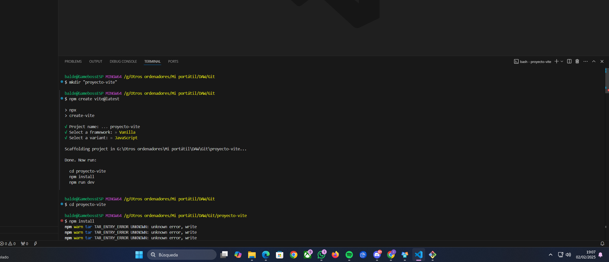

## Parte 1: Configuración Inicial

1.  Crear un nuevo repositorio en GitHub llamado "proyecto-vite-ivanbc"

    

2.  Crear un directorio local para el proyecto

    

3.  Inicializar un proyecto con Vite:

    ```bash
    npm create vite@latest 
    cd [proyecto-vite] 
    npm install 
    ```

    

4.  Inicializar Git en el directorio local, realizando el primer commit

    

    

5.  Conectar el repositorio local con GitHub:

    

## Parte 2: Trabajo con Ramas 

1.  Crear dos ramas nuevas:
    *   desarrollo (para desarrollo general)

    *   feature-ui (para cambios en la interfaz)

          

2.  En la rama feature-ui:
    *   Modificar el componente principal (index.html) de Vite

    *   Realizar al menos 2 commits significativos

        

        
    
3.  En la rama desarrollo:
    *   Añadir un nuevo componente
        
    *   Realizar al menos 2 commits significativos
        
        

        
