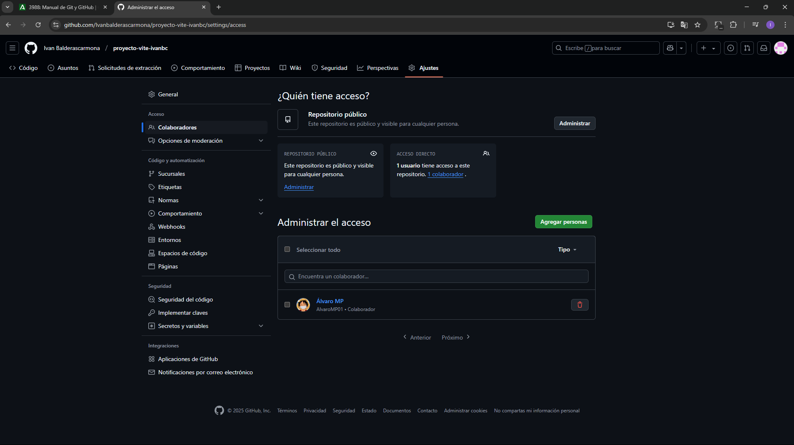
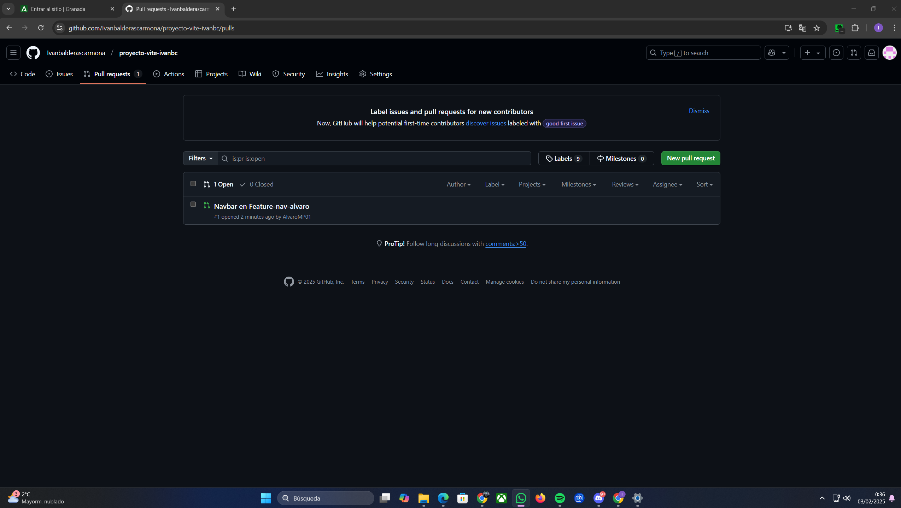

## Parte 1: Configuración Inicial

1.  Crear un nuevo repositorio en GitHub llamado "proyecto-vite-ivanbc"

    

2.  Crear un directorio local para el proyecto

    

3.  Inicializar un proyecto con Vite:

    ```bash
    npm create vite@latest 
    cd [proyecto-vite] 
    npm install 
    ```

    

4.  Inicializar Git en el directorio local, realizando el primer commit

    

    

5.  Conectar el repositorio local con GitHub:

    

## Parte 2: Trabajo con Ramas 

1.  Crear dos ramas nuevas:
    *   desarrollo (para desarrollo general)

    *   feature-ui (para cambios en la interfaz)

          

2.  En la rama feature-ui:
    *   Modificar el componente principal (index.html) de Vite

    *   Realizar al menos 2 commits significativos

        

        
    
3.  En la rama desarrollo:
    *   Añadir un nuevo componente
        
    *   Realizar al menos 2 commits significativos
        
        

        

## Parte 3: Colaboración 

### 3.1 Propietario del Repositorio

1.  Añadir colaboradores al repositorio:
    *   Ir a Settings > Collaborators
    *   Añadir al profesor usando su usuario de GitHub
    *   Añadir a un compañero usando su usuario de GitHub
    *   Asegurarse que ambos reciben y aceptan la invitación

        

### 3.2 Pasos del Colaborador

1.  Aceptar la invitación de colaboración (llegará por email)
    
2.  Clonar el repositorio:

    

3.  Crear y cambiar a una nueva rama:

    

4.  Realizar modificaciones simples y concretas:
    *   Modificar el componente de navegación
    *   Añadir un nuevo botón
    *   Cambiar los estilos del header

        

5.  Añadir y commitear los cambios:

    

6.  Subir la rama al repositorio:

    

7.  Crear el Pull Request:
    *   Ir a GitHub
    *   Clic en "Compare & pull request"
    *   Base: desarrollo ← Compare: new-feature-nav
    *   Título descriptivo
    *   Descripción detallada de los cambios realizados
    *   Asignar al propietario como reviewer
    *   Clic en "Create pull request"
        

### 3.3 Pasos del Propietario para Gestionar el PR

1.  Revisar el Pull Request:
    *   Ir a la pestaña "Pull requests"

        

    *   Abrir el PR creado por el colaborador
    *   Revisar los cambios en la pestaña "Files changed"

        

2.  Solicitar cambios o aprobar:
    *   Si requiere cambios: "Review changes" → "Request changes"
    *   Si está todo correcto: "Review changes" → "Approve"

        

2.  Realizar el merge:
    *   Una vez aprobado, clic en "Merge pull request"

    

    *   Confirmar el merge
    *   Borrar la rama del colaborador si ya no se necesita

        
        
## Parte 4: Integración Final

1.  Realizar merge de la rama desarrollo a main

    

2.  Resolver cualquier conflicto que pueda surgir

    

3.  Realizar un push final a GitHub

    

## Historial de Commits

1. Rama main

    

2.  Rama dessarrollo

    

3. Rama feature-ui

    

## Árbol de commits final


'''bash
 git log --graph --oneline --all
'''


